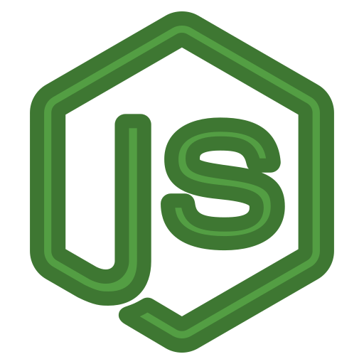
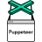
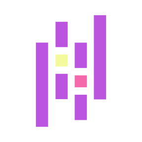

<h1>HiTraveller, I am <a href="https://sites.google.com/view/saifndub">Md Saif Hossain</a>  </h1>

<h3 align="left">Connect & Communicate with me :</h3>

[][linkedin]
[][facebook]
[][kaggle]
[][twitter]
[][youtube]
[][instagram]

- ✍ You can find my projects [here][portfolio]
- 🔭 I’m currently working on my Research
- 🌱 I’m currently learning Computer Vision
- 👯 I’m looking to collaborate on open source
- 💬 Ask me about ... Anything
- 📫 Reach me at saif.ndub@gmail.com
- ⚡ Languages: (Bangla, English, Japanese)

<h3 align="left">Languages and Tools :</h3>

<!--[][c]
[][cpp]
[][nodejs]
[][java]
[ ][php]
[][html5]
[][css3]
--------
[][django]
[][flask]
[</a>][sqlite]
[][oracle]
-------
[][linux]
[][selenium]
[][puppeteer] -->

[][python]
[][power-bi]
[][tableau]
[][pandas]
[][docker]
[][numpy]
[][tensorflow]
[][sklearn]
[][matplotlib]
[][pytorch]
[][scipy]
[][seaborn]

[][js]
[][bootstrap]
[][mysql]
[][mongodb]
[][arduino]

[linkedin]: https://linkedin.com/in/saifndub
[facebook]: https://www.facebook.com/microsoftsaif
[kaggle]: https://www.kaggle.com/saifndub
[twitter]: https://twitter.com/saifndub
[youtube]: https://www.youtube.com/@microsoftsaif
[instagram]: https://www.instagram.com/saifndub     
[portfolio]: https://saifndub.github.io/project
[gmail]: mailto:saif.ndub@gmail.com

[c]: https://www.cprogramming.com/
[cpp]: https://www.w3schools.com/cpp/
[nodejs]: https://nodejs.org
[js]: https://developer.mozilla.org/en-US/docs/Web/JavaScript
[java]: https://www.java.com
[php]: https://www.php.net
[html5]: https://www.w3.org/html/
[css3]: https://www.w3schools.com/css/
[bootstrap]: https://getbootstrap.com
[django]: https://www.geeksforgeeks.org/django-tutorial/
[flask]: https://flask.palletsprojects.com/en/2.3.x/
[oracle]: https://www.oracle.com/
[mysql]: https://www.mysql.com/
[mongodb]: https://www.mongodb.com/
[sqlite]: https://www.sqlite.org/
[arduino]: https://www.arduino.cc/
[linux]: https://www.linux.org/
[selenium]: https://www.selenium.dev/
[puppeteer]: https://pptr.dev/
[azure]: https://azure.microsoft.com/
[aws]: https://aws.amazon.com/

[python]: https://www.python.org
[docker]: https://www.docker.com/
[pandas]: https://pandas.pydata.org/
[numpy]: https://numpy.org/
[pytorch]: https://pytorch.org/
[scipy]: https://scipy.github.io/devdocs/index.html
[seaborn]: https://seaborn.pydata.org/
[matplotlib]: https://matplotlib.org/
[sklearn]: https://scikit-learn.org/stable/
[tensorflow]: https://www.tensorflow.org
[tableau]: https://www.tableau.com/
[power-bi]: https://powerbi.microsoft.com/

<!--https://docs.scipy.org/doc/-->
<!--
[][azure]

 

-->

<!--
[][linkedin]
[][linkedin]

[linkedin]: https://linkedin.com/in/saifndub
-->

